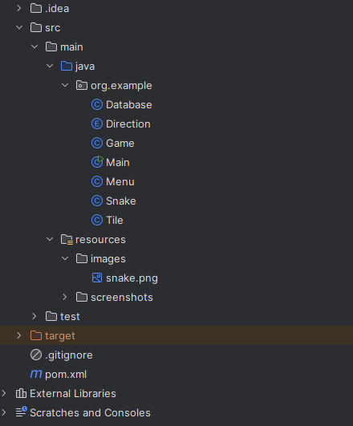

# CurveFeverGame

Autor: Krzysztof Maciejończyk

CurveFeverGame to projekt aplikacji konsolowej umożliwiającej grę typu snake multiplayer. 
Projekt powstał w celu połączenia ze sobą różnych aspektów programistycznych, w tym wielowątkości (wykrywanie kolizji u węży (**Snake.java**)), aplikacji konsolowej (awt i swing), dostępu do bazy danych (baza powstała na kontenerze w Docker Desktop) oraz testów jednostkowych (**GameTest.java**).

Po włączeniu aplikacji, użytkownikowi ukazuje się menu główne (**Menu.java**), które pozwala na wybór liczby graczy (1-4). Następnie należy wcisnąć przycisk "Start Game" w celu rozpoczęcia rozgrywki.

Następuje przejście do innego okna (**Game.java**), w którym występują plansza gry, tablica wyświetlająca wyniki poszczególnych graczy oraz przyciski sterowania. Każdy z graczy dysponuje swoimi własnymi klawiszami do sterowania swoim wężem.
Po kilku sekundach węże zaczynają samoistnie się poruszać do przodu, zadaniem użytkownika jest przetrwanie jego węża jak nadłużej bez kolizji z innymi wężami, sobą oraz ze ścianami. Gdy jeden gracz zostanie sam na planszy to automatycznie wygrywa i po naliczeniu punktu, gra rozpoczyna się na nowo.

Poniżej przedstawiono zrzuty ekranów poszczególnych okien oraz funkcjonalności:

**Menu główne programu**

**Okno gry**

**Baza danych zliczająca liczbę zwycięstw graczy**

**Drzewo projektu**

**Testy jednostkowe**
